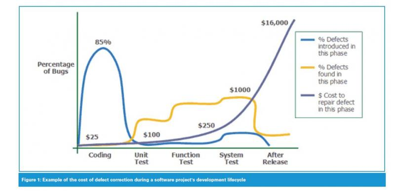

# Agile Servicenow Development

---

## Como garantir a velocidade e qualidade da entrega ?

---

## Autonomia dos Desenvolvedores

+++

### Documentação

+++


+++

### O que documentar ?

+++

Informações que melhor são comunicadas por escrito.

+++

Especificação feita por exemplos: User Stories.

+++

Apenas escrever documentação que se esta disposto a manter atualizada.

Se não for possível, adicionar uma data de expiração.

+++

Transformar essa especificação em testes automatizados.

+++

> Scrum teams make testing a central practice and part of the development process rather
> than something that happens after the developers are "done." Rather than trying to test
> quality after a product has been built, we build quality into the process and product as it is being developed.
>
> Succeeding with Agile Software Development

+++

> Suppose I ask you to estimate
> two things for me: first, a handful of new features; and second, how long it
> will take to test and fix the bugs in a product that has been in development
> for six months and is now ready for its first round of testing.

+++

> Most people
> will agree that estimating the new work is far easier and more likely to
> be accurate. Periodic (or better yet, continuous) testing of a product is a
> probe into that product that lets us know how far along we are.
>
> Succeeding with Agile Software Development

+++



+++

> How much change is typical? Studies at IBM and other companies have found that the average
> project experiences a 25% change in requirementes during development, which accounts for
> 70 to 85 percent of the rework on a typical project.
> 
> Code Complete, Steve McConnell


+++

### Em 9 meses de Scrum a Salesforce conquistou os seguintes resultados

+++ 

- Reduziu o número de funcionarios envolvidos em seus 9 deploys em 65% (para 15 pessoas)
- Reduziu o tempo gasto em tedes no go-live: 2~3 horas de trabalho manual viraram 15 minutos de testes automatizados |
- Reduziu o tempo gasto com testes após release: 4 horas de testes manuais em 45 minutos rodando mais de 200 testes automatizados |
- Reduziu a quantidade de pessoas envolvidas no release de patches em 80% |

---

## Testes Automatizados

+++

> Automation on a Scrum project is not optional. For a team to sprint effectively
> (and therefore deliver value quickly), it needs to rely heavily on test automation.
> [ ... ]
> A highly automated test suite is considered mandatory
> by Scrum teams; it is considered a luxury by traditional teams.
>
> Succeeding with Agile Software Development

+++

### Unit Testing

> Unit testing is one of the most important components in legacy code work.
> System-level regression tests are great, but small, localized tests are invaluable.
> They can give you feedback as you develop and allow you to refactor with much more safety.
>
> Working Effectively with Legacy Code, Michal C. Feathers

+++

## Servicenow e os Testes Automatizados

+++


+++

- Automated Testing Framework
- Jasmine |

+++

### Anatomia de um teste

```javascript
describe("Something", function() {

    it("does does another thing", function() {
      var sum = 1 + 2;

      expect(sum).toBe(3);
    });

});
```

@[1, 9]
@[3, 7]
@[4, 6]

+++

```javascript
expect(3).toBe(3);
expect(5).not.toBe(3);
expect(null).toBeNull()
expect(som_var).toBeDefined();
expect("foo bar").toMatch(/bar/);
expect({a: "sauron"}).toEqual({a: "sauron"});

toBeUndefined()
toBeTruthy()
toContain()
toBeLessThan()
toThrow()
```

+++

## Red -> Green -> Refactor

+++


+++

```javascript
it("finds the manager", function() {

  var edit_gr = new GlideRecord("u_edit_competition")
  edit_gr.get("982h3oeppslvufk2ou3b2133")

  var city_gr = new GlideRecord("u_city");
  city_gr.get("039vns3l12l430409234n2")

  var manager = StoreModel.findManager(edit_gr);
  var MANAGER_ID = city_gr.getValue("u_manager");

  expect(manager).toEqual(MANAGER_ID);

});
```
@[3 - 7]
@[9]
@[10]
@[12]

+++

E esse `GlideRecord` ai ?

+++

**Snapshots** !

+++

```javascript
it("Successfully finds the manager", function() {

  var edit_gr = Snap.createRecord("MOCK0001006");
  var city_gr = Snap.createRecord("MOCK0001007");

  var manager = StoreModel.findManager(edit_gr);
  var MANAGER_ID = city_gr.getValue("u_manager");

  expect(manager).toEqual(MANAGER_ID);

});
```
@[3, 4]
@[6, 7]
@[9]

+++

### Red

```
----- Tests Complete -----
Spec :: StoreModel starts a new competition editing :: passed
Spec :: StoreModel finds the manager :: failed
  Expected undefined to equal 'd11b4b4a0f850300604d09bce1050ee8'.
  Test results :: (3/4) :: failed
```

@[3, 4]

+++

```javascript
/**
 * Encontra o Gerente da loja.
 *
 * @param  {GlideRecord} gr Loja
 * @return {string|false}    Id do manager ou `false`
 */
StoreModel.findManager = function(gr) {
  var city_gr = new GlideRecord("u_city");
  var city_name = gr.getValue("u_city");

  return city_gr.get("u_name", city_name)
    ? city_gr.getValue("u_manager")
    : false;
};

```

+++

### Green

```
----- Tests Complete -----
Spec :: StoreModel starts a new competition editing :: passed 
Spec :: StoreModel finds the manager :: passed 
Test results :: (4/4) :: passed 
```

@[3]

---


+++


+++


+++


+++


